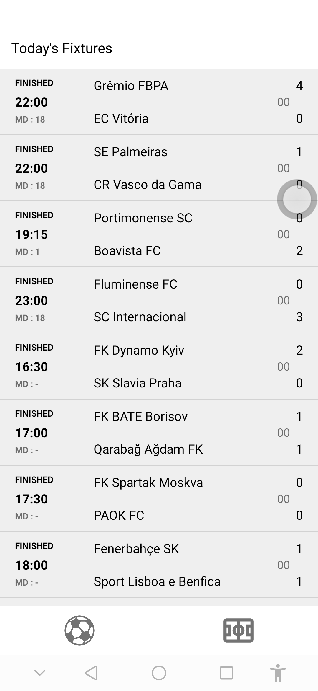
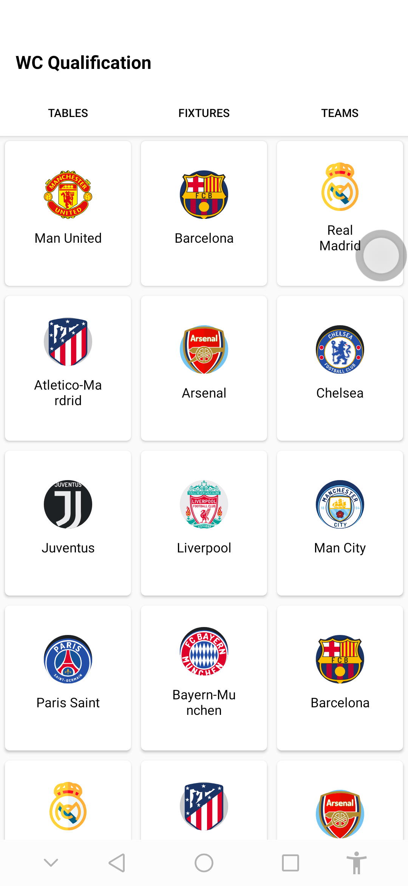

# FootballFixturesApp
Android Football Fixtures app that consumes fixtures data from https://www.football-data.org




# Database
Room used!

# Tests
Espresso && JUnits

# Resources
Most of the icons can be found on https://materialdesignicons.com/

# Setup
Obtain your API KEY from https://www.football-data.org for free and update Constants.java

```
/*
 * Copyright (c) 2019. Emmanuel Uche
 */

package com.android.assessment.footballapp.workers;

public class Constants {

    ...
    
    /*Replace with your api_key obtained */
    static final String API_KEY = "YOUR_API_KEY";
}

```

# ...
APK-> app/release/
<br/>
Goodluck!!
